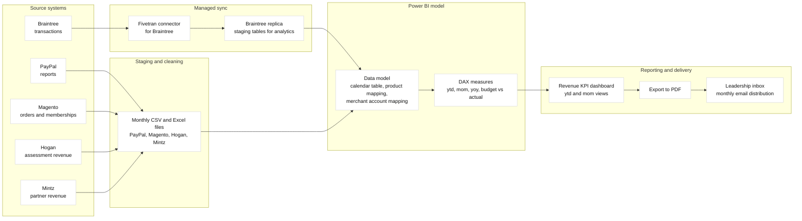

## 1. TL;DR

Monthly revenue KPI dashboard built in Power BI using data from Braintree, PayPal, Magento, Hogan, and Mintz.  
I consolidated multiple sources, including a Fivetran pipeline that synced Braintree into analytics ready tables, modeled everything in Power BI, and produced a monthly PDF report that leadership used to track YTD and MoM revenue versus prior year and budget.

---

## 2. Problem and context

Revenue was spread across several systems:

- Braintree and PayPal for payments  
- Magento for orders, memberships, and renewals  
- Hogan and Mintz for partner and assessment revenue  

Leadership did not have a single place to answer questions like:

- How are we tracking this year compared to last year  
- Are we on target against the revenue budget  
- How are ECS, memberships, renewals, Hogan, and other programs performing month over month  

My task was to create a recurring monthly report that combined all of this into one KPI view.

---

## 3. Requirements

**Functional**

- Consolidate revenue from Braintree, PayPal, Magento, Hogan, and Mintz  
- Support year to date, month over month, and year over year comparisons  
- Break down revenue for key business areas:
  - ECS  
  - Memberships  
  - Renewals  
  - Hogan  
  - Other programs  
- Compare current year against previous year and against budget

**Non functional**

- Simple to maintain each month  
- Fast refresh once new data is available  
- Easy for non technical stakeholders to consume in PDF format

---

## 4. Architecture overview



5\. Data flow
-------------

1.  **Extract**
    
    *   Used a **Fivetran Braintree connector** to keep a fresh replica of Braintree transactions in analytics friendly tables.
        
    *   Exported payment reports from **PayPal**.
        
    *   Exported orders, memberships, and renewals from **Magento**.
        
    *   Exported revenue summaries from **Hogan** and **Mintz**.
        
2.  **Staging and cleaning**
    
    *   Read Braintree data from the Fivetran managed tables instead of manual CSV exports.
        
    *   Loaded PayPal, Magento, Hogan, and Mintz as CSV or Excel files.
        
    *   Standardized date fields such as settlement date and order date.
        
    *   Normalized currencies and amounts where needed.
        
    *   Mapped products or SKUs into business categories:
        
        *   Membership
            
        *   Renewal
            
        *   ECS
            
        *   Hogan
            
        *   Other
            
3.  **Model in Power BI**
    
    *   Loaded the Fivetran Braintree tables and the other source exports into Power BI.
        
    *   Built a Date table to support:
        
        *   YTD
            
        *   month to date
            
        *   month over month
            
        *   year over year
            
    *   Created relationships between:
        
        *   Date and each fact table
            
        *   Product mapping and transaction tables
            
        *   Merchant accounts and payment data
            

4. Core measures followed patterns like:

```DAX
Revenue :=
SUM ( 'Transactions'[Settlement Amount] )

Revenue YTD :=
CALCULATE (
    [Revenue],
    DATESYTD ( 'Date'[Date] )
)

Membership Revenue :=
CALCULATE (
    [Revenue],
    'ProductMap'[Category] = "Membership"
)

Renewal Revenue :=
CALCULATE (
    [Revenue],
    'ProductMap'[Category] = "Renewal"
)
```

    
5.  **Reporting and distribution**
    
    *   Built a multi section report in Power BI.
        
    *   Refreshed data from the Fivetran Braintree replica and from the other source exports.
        
    *   Exported the report as PDF each month and emailed it to leadership.    


6\. KPI design
--------------

The report was structured around how leadership thought about the business.

**Top level**

*   YTD BlueSteps revenue: current year vs previous year vs budget
    
*   Total revenue across all merchant accounts
    

**Program specific**

*   ECS revenue trend and YTD performance
    
*   Memberships and renewals as separate views
    
*   Hogan and Mintz revenue over time
    

**Time series**

*   Month over month charts for:
    
    *   Total revenue
        
    *   Memberships
        
    *   Renewals
        
    *   ECS
        
    *   Hogan
        

Visual choices were kept simple for non technical readers:

*   Clustered column and line charts
    
*   Consistent color coding for year and scenario
    
*   Clear labels for actual vs budget vs prior year
    

7\. Operations workflow
-----------------------

This was not a one time dashboard. It was a recurring monthly process.

1.  End of month.
    
2.  Fivetran syncs the latest Braintree data.
    
3.  Export files from PayPal, Magento, Hogan, and Mintz.
    
4.  Refresh Power BI model with the new data.
    
5.  Reconcile totals against source reports.
    
6.  Regenerate KPIs and visual pages.
    
7.  Export as PDF and email to stakeholders.
    

This loop ensured leadership had a fresh view of revenue after each month closed.

8\. Design decisions and trade offs
-----------------------------------

**Fivetran for Braintree, manual exports for the rest**

*   Braintree was one of the most critical and frequently used payment sources.
    
*   I used **Fivetran** to automate the Braintree extraction and keep analytics tables up to date.
    
*   Other systems (PayPal, Magento, Hogan, Mintz) stayed on scheduled manual exports, which was enough for a monthly cadence and avoided extra cost or setup complexity.
    

**Single Power BI file**

*   Kept data cleaning, modeling, and visuals in one place.
    
*   Simplified maintenance and handoff to other analysts.
    

**PDF delivery**

*   Stakeholders already worked from email.
    
*   Static PDFs avoided confusion from changing numbers during the month.
    
*   No additional portal or tool training was required.
    
    

9\. What I would do today
-------------------------

If I rebuilt this project now, I would:

*   Extend the Fivetran style automation beyond Braintree to other key systems so that most sources are ingested continuously.
    
*   Land cleaned data in a warehouse or lakehouse and reuse it for other analytics and self service BI.
    
*   Publish the Power BI report to an online workspace with scheduled refresh and role based access.
    
*   Add drill through pages for cohorts, geography, and marketing campaigns so stakeholders can explore more detail without extra reports.

10\. Dashboard tour
-------------------

Below is how the dashboard looked from a stakeholder perspective.Each page focuses on a different level of the revenue story.

### 10.1 Executive summary (Page 1)

**Purpose**

Give leadership a quick answer to:

*   How are we tracking year to date versus last year
    
*   Are we above or below the 2024 revenue budget
    
*   How much ECS, memberships, and renewals are contributing to total revenue
    

**Key elements**

*   YTD BS Revenue comparing:
    
    *   2023 actual
        
    *   2024 budget
        
    *   2024 YTD actual
        
*   ECS revenue YTD vs budget.
    
*   Total revenue across all merchant accounts.
    

### 10.2 Program drilldown (Page 2)

**Purpose**

Let finance and marketing see which programs are driving growth.

**Key elements**

*   Month over month charts for:
    
    *   Membership revenue
        
    *   Renewal revenue
        
    *   ECS revenue
        
*   Hogan and Mintz revenue trends.
    
*   Total revenue MoM with 2023 vs 2024 for context.
    

Each visual is driven by the measures described in the system design section above.

11\. How this fits with my other dashboards
-------------------------------------------

This revenue KPI dashboard sat next to my other reporting assets:

*   **Magento → Zapier → Google Sheets → Looker Studio**Day to day operational dashboards for orders, memberships, and campaign performance.
    
*   **Securing a Fabric data warehouse with RLS and CLS**Later work focused on hardening data access for analytics workloads in Microsoft Fabric.
    

In practice, the BlueSteps KPI dashboard was the monthly executive view, while the Magento and Fabric projects focused on the underlying pipelines and secure self service analytics. 

This would turn the same KPI logic into a more automated analytics platform while keeping the business friendly views that made the original report successful.
